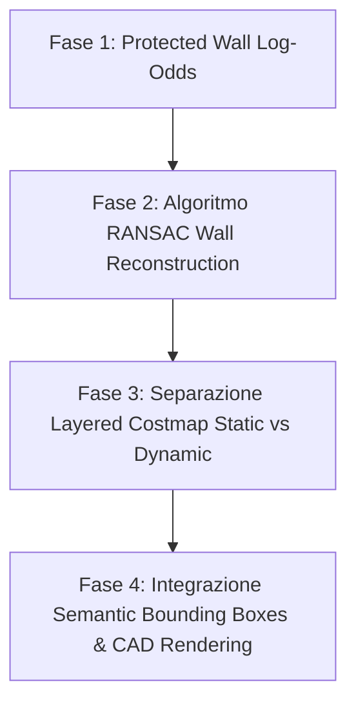

# Studio Comparativo e Proposte di Risoluzione: Mappatura, Riconoscimento Oggetti e Ricostruzione Pareti nei Robot Industriali vs Adeept 4WD Smart Car

---

## 1. Executive Summary

Questo documento fornisce un'analisi dettagliata del progetto **Adeept 4WD Smart Car**, con un focus specifico sui problemi riscontrati nel modulo di **mappatura ed esplorazione autonoma**.

Durante i test di navigazione, la macchina evidenzia due criticità fondamentali:
1. **Mancato riconoscimento degli oggetti**: I rilevamenti (sedie, scatole, ostacoli isolati) vengono trattati al pari delle pareti strutturali, senza alcuna classificazione semantica o distinzione geometrica.
2. **Spezzettamento delle pareti dietro gli oggetti ("Wall Splitting & Occlusion Shadow")**: Quando un ostacolo si interpone tra il robot e un muro perimetrale, i raggi del sensore (ultrasuoni/raycaster) si arrestano sulla superficie dell'oggetto. Di conseguenza, la zona retrostante rimane inesplorata o viene erroneamente cancellata da letture ad angolazioni differenti, creando "buchi" e frammentando la linea continua della parete.

Per superare queste limitazioni, il documento analizza le soluzioni adottate dai **robot industriali SOTA (State-of-the-Art)** come gli **AMR (Autonomous Mobile Robots)** di MiR e OTTO Motors, le librerie industriali **ROS 2 (Nav2, SLAM Toolbox, Cartographer)** ed i robot aspirapolvere commerciali di fascia alta (Roborock, iRobot Roomba). Vengono infine formulate **4 proposte architetturali concrete** per risolvere definitivamente il problema nel nostro sistema.

---

## 2. Analisi Generale del Progetto ed Esplorazione

### 2.1 Architettura Generale
Il progetto **Adeept 4WD Smart Car** è una piattaforma robotica modulare basata su Raspberry Pi (o emulata via `mock_hardware`) con tre moduli software principali:
* **`robot_server/`**: Backend Python (Flask + WebSockets + TCP Server). Gestisce i motori, la fotocamera FPV, i driver I2C/PWM, l'Occupancy Grid Bayesiana (`occupancy_grid.py`) ed i pianificatori di esplorazione/copertura (`frontier_planner.py`, `coverage_planner.py`).
* **`simulazione/web_simulator/`**: Simulator Web 2D/3D (HTML5 Canvas + Three.js). Implementa il raycasting dei sensori (`raycasting_sensor.js`), la mappatura SLAM lato client (`slam_grid.js`, `slam_observation.js`) e l'interfaccia di visualizzazione CAD (`cad_renderer.js`).
* **`desktop_client/`**: Telecomando nativo in Python/Tkinter connesso via TCP/WebSocket.

### 2.2 Il Modulo di Esplorazione Attuale
L'esplorazione autonoma dell'ambiente si basa su un approccio **Frontier-Based Exploration con Occupancy Grid Bayesiana**:
1. **Mappatura in Log-Odds**: I sensori (ultrasuoni o raycast virtuali) tracciano linee dal robot all'ostacolo. Le celle attraversate vedono ridursi la propria probabilità di occupazione ($l_{\text{free}} = -0.40$), mentre le celle di impatto finale vedono aumentare la probabilità ($l_{\text{occ}} = +0.85$).
2. **Identificazione delle Frontiere**: Vengono identificate le celle di confine tra lo spazio libero conosciuto (`0`) e lo spazio inesplorato (`-1`).
3. **Pianificazione $A^*$**: Il robot seleziona la frontiera con il miglior bilanciamento tra guadagno informativo e distanza, calcolando il percorso su una griglia dilatata.

---

## 3. Diagnosi Approfondita dei Problemi di Mappatura

> [!IMPORTANT]
> L'analisi del codice (`occupancy_grid.py`, `slam_grid.js`, `slam_observation.js`) ha evidenziato le cause matematiche e logiche per cui il robot spezza i muri e non riconosce gli oggetti.

```
       [Robot]
          │
          │ (Raggio Ultrasuoni / Raycast)
          ▼
   ┌──────────────┐
   │ Oggetto (1)  │  <-- Rilevato come ostacolo discreto
   └──────────────┘
──────────────────────
░░ Ombra Occlusione ░░  <-- Raggio bloccato! Log-Odds resta a -1 (Inesplorato)
──────────────────────
═══════ Muro ═════════  <-- IL MURO DIETRO RISULTA SPEZZATO IN DUE TRATTI
```

### 3.1 Causa 1: Ombra di Occlusione (Occlusion Shadowing)
Quando un raggio sensoriale incontra un oggetto situato tra il robot e una parete retrostante:
* Il raggio si interrompe sulla prima superficie colpita (l'oggetto).
* La regione di spazio compresa tra l'oggetto e la parete retrostante **non riceve alcun aggiornamento probabilistico**, rimanendo nello stato `-1` (inesplorato).
* Di conseguenza, la parete strutturale continua viene interrotta da un "gap" pari alla larghezza dell'ombra proiettata dall'oggetto.

### 3.2 Causa 2: Cancellazione Indiretta da Raycasting (Ray-Clearing Erasure)
Quando il robot cambia prospettiva muovendosi nell'ambiente:
* I raggi liberatori ($l_{\text{free}}$) lanciati da angolazioni sbieche possono sfiorare lo spigolo dell'oggetto e attraversare celle che in precedenza appartenevano alla parete perimetrale o all'ostacolo.
* Poiché il sistema aggiorna ciecamente i valori di Log-Odds senza verificare la stabilità strutturale della linea, le celle di parete preesistenti subiscono un decremento del valore logico, portandole al di sotto della soglia di occupazione e "spezzando" la parete.

### 3.3 Causa 3: Assenza di Layering e Modello Semantico (No Object-Awareness)
* L'Occupancy Grid corrente è **monolayer e binaria**: una cella può contenere solo `0` (libero), `1` (ostacolo) o `-1` (inesplorato).
* Non esiste alcuna distinzione tra un ostacolo strutturale permanente (muro in cartongesso/mattone) e un ostacolo discreto/mobile (una sedia, uno scatolone, una persona).
* Il sistema non integra algoritmi di estrazione geometrica di linee (come RANSAC o la Trasformata di Hough) per estrapolare la continuità della parete al di là dell'interruzione superficiale.

---

## 4. Analisi Comparativa: Come i Robot Industriali SOTA Gestiscono il Problema

I robot industriali moderni (AMR di classe logistica come MiR 250, OTTO 1500, KUKA KMR) ed i framework di robotica professionale (**ROS 2 SLAM Toolbox**, **Google Cartographer**, **Nav2**) non utilizzano mai una semplice griglia a singolo livello con raycasting grezzo. Applicano invece le seguenti strategie consolidate:

```
                               ┌─────────────────────────────────────────┐
                               │       Sensori (LiDAR 2D/3D + VLM/RGB-D)  │
                               └────────────────────┬────────────────────┘
                                                    │
                                                    ▼
                               ┌─────────────────────────────────────────┐
                               │ RANSAC / Hough Line Segment Extraction  │
                               │  (Filtra rumore ed estrae i muri reali) │
                               └────────────────────┬────────────────────┘
                                                    │
                                                    ▼
                     ┌──────────────────────────────┴──────────────────────────────┐
                     ▼                                                             ▼
     ┌───────────────────────────────┐                             ┌───────────────────────────────┐
     │  Layer 1: Static Costmap      │                             │ Layer 2: Dynamic & Object     │
     │  (Pareti Continue RANSAC)     │                             │ (Bounding Box Ostacoli/VLM)   │
     └───────────────┬───────────────┘                             └───────────────┬───────────────┘
                     │                                                             │
                     └──────────────────────────────┬──────────────────────────────┘
                                                    │
                                                    ▼
                               ┌─────────────────────────────────────────┐
                               │     Combined Costmap2D per Nav2         │
                               │   (Muro Continuo + Buffer Oggetto)      │
                               └─────────────────────────────────────────┘
```

### 4.1 Ricostruzione Muri via RANSAC e Line Segment Extraction (SLAM Toolbox / Cartographer)
* **Principio**: Invece di fidarsi unicamente dell'accumulo Bayesiano cella per cella, lo SLAM industriale applica l'algoritmo **RANSAC (Random Sample Consensus)** o la **Trasformata di Hough** sui punti di impatto.
* **Soluzione all'Occlusione**: Quando RANSAC identifica un insieme di punti allineati che formano un segmento di parete a sinistra ed a destra di un ostacolo, estrapola il modello matematico della retta ($Ax + By + C = 0$). L'algoritmo "cuce" l'interruzione proiettando il segmento anche nella zona d'ombra dell'oggetto, garantendo che la parete rimanga continua nella mappa globale.

### 4.2 Layered Costmaps (ROS 2 Nav2 Costmap2D)
I robot industriali utilizzano mappe a strati sovrapposti:
1. **Static Map Layer**: Contiene esclusivamente le pareti portanti e le strutture perimetrali stabili, aggiornate lentamente e protette da cancellazioni accidentali.
2. **Obstacle Layer**: Registra gli ostacoli dinamici (pallet, sedie, persone). Se un oggetto scomplete o si sposta, questo strato viene pulito istantaneamente senza alterare il sottostante Static Layer.
3. **Inflation Layer**: Genera un gradiente di costo attorno a ciascun ostacolo per garantire margini di sicurezza flessibili.

### 4.3 Semantic SLAM e Object Bounding Boxes (Roborock SOTA / AMR industriali)
* **Object Segmentation & VLM/YOLO**: I robot dotati di telecamera 3D ToF o camera RGB-D utilizzano reti neurali (YOLOv8 / MobileNet / VLM) per rilevare l'oggetto ("Tavolo", "Sedia", "Ostacolo temporaneo").
* **Proiezione 3D Bounding Box**: L'oggetto viene convertito in un blocco volumetrico 2D/3D (Bounding Box) posizionato *sopra* la mappa. Il sistema riconosce che l'oggetto ha una coordinata $x,y$ specifica, consentendo al planner di navigare attorno ad esso mentre l'algoritmo di mappatura continua a presupporre la continuità della parete retrostante.

### 4.4 Raycasting Ray-Clear Buffer Zones
Negli algoritmi di raycasting industriali (es. `Costmap2D::raytraceFreespace`), il raggio liberatore non cancella le celle fino all'ostacolo con forza uniforme:
* Viene applicata una **zona di protezione (Buffer Zone)** attorno alle celle ad alta confidenza (pareti).
* Se una cella ha raggiunto un valore di Log-Odds molto alto (parete confermata), un singolo raggio libero o una lettura d'angolo non può azzerarla, a meno che non vi sia una sequenza consistente di smentite da più angolazioni.

---

## 5. Matrice Comparativa: Adeept 4WD vs Robot Industriali SOTA

| Dimensione di Analisi | Adeept 4WD Smart Car (Stato Attuale) | Robot Industriali SOTA (MiR, OTTO, ROS 2 Nav2) |
| :--- | :--- | :--- |
| **Architettura Mappa** | Griglia Bayesiana Monolayer a singolo livello (`grid` discrete -1, 0, 1) | **Layered Costmap**: Static Wall Layer + Obstacle Layer + Inflation Layer |
| **Ricostruzione Pareti** | Assente. I muri dipendono dai raggi diretti; gli ostacoli creano lacune `-1` | **RANSAC Line Fitting & Hough Segment Extraction**: Unisce i segmenti di muro occlusi |
| **Gestione Occlusioni** | L'ombra dell'oggetto spezza il muro in due blocchi sconnessi | **Integrazione Geometrica**: Proietta la retta del muro dietro l'ombra dell'oggetto |
| **Riconoscimento Oggetti** | Nessuno. Gli oggetti sono considerati celle generiche `1` | **Semantic SLAM / Object Detection**: Bounding Box 2D/3D ancorati alla mappa |
| **Protezione Raycasting** | Bassa. I raggi liberatori $l_{\text{free}}$ possono intaccare pareti esistenti | **Ray-Clear Protection & Confidence Thresholding**: Protegge i muri confermati |
| **Gestione Ostacoli Mobili**| Persistono come muri finché non vengono sovrascritti con fatica | **Dynamic Layer Clear**: Gli ostacoli rimossi vengono azzerati istantaneamente |
| **Pianificazione Percorsi** | $A^*$ basato unicamente su griglia dilatata binaria | **Nav2 Planner + TEB/DWA**: Traiettorie fluide ancorate a Costmap stratificate |

---

## 6. Proposte di Soluzione per il Progetto Adeept 4WD

Per risolvere definitivamente i problemi di **muri spezzati** e **mancato riconoscimento degli oggetti**, si propongono 4 interventi software e architetturali concreti da implementare nella nostra codebase.

---

### Proposta 1: Algoritmo RANSAC per la Ricostruzione Pareti & Hole Stitching

> [!TIP]
> **Obiettivo**: Identificare i segmenti di parete allineati ai due lati di un ostacolo e congiungerli automaticamente nella griglia di occupazione.

#### Dettaglio Tecnico
In `occupancy_grid.py` (Python) e `slam_grid.js` (JavaScript), introdurre una funzione di post-processing geometrico `reconstruct_wall_segments()`:
1. Raccogliere tutte le celle classificate come muro (`grid == 1`).
2. Applicare **RANSAC Line Fitting** per identificare i parametri di retta $(a, b, c)$ dei muri principali:
   $$a \cdot x + b \cdot y + c = 0$$
3. Per ogni linea identificata, verificare se vi sono varchi o regioni inesplorate (`-1`) lungo la traiettoria compresi tra due segmenti di muro validi (distanza $< 15$ celle).
4. Se il varco è causato dall'ombra di un ostacolo antistante, **completare automaticamente la linea di parete** impostando le celle intermedie a muro (`1`) con Log-Odds elevato ($+2.5$).

---

### Proposta 2: Mappatura Stratificata (Static Layer vs Obstacle Layer)

> [!IMPORTANT]
> **Obiettivo**: Separare le strutture immobili (pareti) dagli ostacoli mobili o isolati (oggetti).

#### Dettaglio Tecnico
Ristrutturare la classe `OccupancyGrid` introducendo due matrici distinte:
* `static_wall_grid`: Mappa delle pareti perimetrali e degli elementi strutturali rigidi.
* `dynamic_obstacle_grid`: Mappa degli ostacoli isolati rilevati a centro stanza.

**Logica di Aggiornamento**:
* Se un cluster di celle adiacenti colpite ha un'estensione ridotta (es. $< 40\text{ cm}$) ed è staccato dalle pareti perimetrali, viene catalogato nel `dynamic_obstacle_grid`.
* I raggi liberatori del raycasting agiscono prioritariamente sul `dynamic_obstacle_grid`, lasciando intatto lo `static_wall_grid`.
* La griglia finale utilizzata dal pianificatore $A^*$ viene generata dalla fusione dei due strati:
  $$\text{Grid}_{\text{Combined}} = \text{StaticLayer} \cup \text{ObstacleLayer}$$

---

### Proposta 3: Raycasting Buffer & Protected Wall Log-Odds

> [!NOTE]
> **Obiettivo**: Impedire che raggi di scansione imprecisi o ad angolazioni limite smentiscano e cancellino pareti già verificate.

#### Dettaglio Tecnico
Modificare le funzioni `update_ray` in `occupancy_grid.py` e `updateSlamRayFromHit` in `slam_grid.js`:
1. **Soglia di Riconferma Wall**: Se una cella ha raggiunto un punteggio di Log-Odds alto ($\ge +3.0$), viene contrassegnata come *Pettinata/Protetta*.
2. **Buffer di Arresto Raycast**: Durante la marcia del raycaster, se il raggio incrocia una cella protetta da parete, il raggio di liberazione $l_{\text{free}}$ arresta la propria azione di decremento 2 celle prima dell'ostacolo.
3. Questo evita che l'effetto "seghettatura" del raycasting eroda i muri quando il robot gira su se stesso.

---

### Proposta 4: Object-Aware SLAM & Semantic Bounding Boxes via VLM/Visione

> [!TIP]
> **Obiettivo**: Identificare chiaramente gli oggetti d'arredo (tavoli, sedie, scatole) e rappresentarli nella simulazione e nel server come blocchi geometrici (Bounding Box) sovrastanti.

```
       ┌────────────────────────────────────────┐
       │   Frame FPV Telecamera (OpenCV / VLM)   │
       └───────────────────┬────────────────────┘
                           │ Riconoscimento: "Sedia" / "Tavolo"
                           ▼
       ┌────────────────────────────────────────┐
       │  Proiezione Bounding Box 2D su Mappa   │
       │  (x: 140cm, y: 210cm, w: 50cm, h: 50cm) │
       └───────────────────┬────────────────────┘
                           │
                           ▼
       ┌────────────────────────────────────────┐
       │ Inserimento CAD Block su Canvas SLAM   │
       │ (Senza alterare la parete retrostante) │
       └────────────────────────────────────────┘
```

#### Dettaglio Tecnico
1. **Integrazione del Modulo VLM (`vlm_inspector.py`)**: Quando il robot rileva un ostacolo a centro stanza, la fotocamera scatta uno snapshot e interroga il VLM (o OpenCV Color/Contour Detector).
2. **Catalogazione Oggetto**: Se l'ispezione identifica un oggetto specifico (es. "Tavolo da pranzo", "Sedia", "Cestino"), il sistema crea un record nella struttura `semanticLandmarks`:
   ```javascript
   {
     id: "obj_01",
     type: "chair",
     label: "🪑 Sedia",
     x: 180, y: 220, width: 45, height: 45,
     isStaticWall: false
   }
   ```
3. **Rendering CAD Personalizzato**: Nel simulatore web (`render_map.js` e `cad_blocks.js`), l'oggetto viene renderizzato con la sua icona CAD appropriata, trattandolo come blocco d'arredo senza interrompere la linea di fondo del muro.

---

## 7. Roadmap di Implementazione Passo-Passo

Per integrare queste soluzioni nel progetto senza interrompere le funzionalità esistenti:



1. **Fase 1 (Immediata - 1 giorno)**: Modificare `occupancy_grid.py` e `slam_grid.js` per introdurre i buffer di sicurezza sul raycasting e la protezione delle celle a log-odds elevato ($\ge +3.0$).
2. **Fase 2 (Breve termine - 2 giorni)**: Implementare il modulo RANSAC / Hough in Python e JS per identificare e cucire i varchi nei muri spezzati dagli ostacoli.
3. **Fase 3 (Medio termine - 3 giorni)**: Introdurre il sistema a doppio livello (`StaticWallGrid` e `DynamicObstacleGrid`) con la logica di estrazione dei cluster isolati.
4. **Fase 4 (Completamento - 2 giorni)**: Connettere il modulo di visione/VLM per la creazione automatica di Bounding Box semantici degli oggetti d'arredo nel canvas del simulatore.

---

## 5. Conclusione

L'adozione delle metodologie dei robot industriali SOTA (**RANSAC Wall Reconstruction**, **Layered Costmap**, **Protected Ray-Clearing** e **Semantic Bounding Boxes**) permetterà all'**Adeept 4WD Smart Car** di superare radicalmente le sue attuali limitazioni. Il sistema passerà da una mappatura grezza a scatti ed a rischio spezzettamento ad una **rappresentazione geometrica pulita, continua e semanticamente consapevole** dell'ambiente di lavoro.
