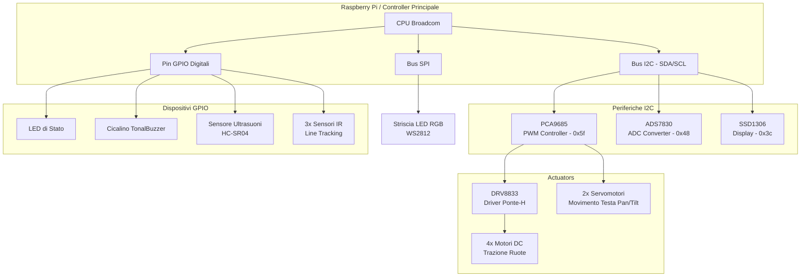

# Analisi dell'Architettura Hardware e dei Moduli Mock

Questo documento illustra l'architettura hardware del robot **Adeept 4WD Smart Car** e descrive come i file mock presenti nella directory `mock_hardware` ne emulino il comportamento. Questa simulazione consente di sviluppare e testare il software del robot su sistemi di sviluppo personali (come macOS o Windows) senza la necessità di un Raspberry Pi fisico o di schede elettroniche collegate.

---

## 🗺️ Schema delle Connessioni Hardware

La seguente mappa mostra come il Raspberry Pi (il "cervello" del robot) interagisce con i chip e i sensori tramite i diversi protocolli di comunicazione.



---

## 🔌 1. Bus I2C e Mappatura Pin ([board.py](../../mock_hardware/board.py), [busio.py](../../mock_hardware/busio.py))

### Il Componente Reale
Il bus **I2C (Inter-Integrated Circuit)** consente a più circuiti integrati di comunicare su una linea condivisa usando solo due segnali:
*   **SCL (Serial Clock)**: Fornisce gli impulsi temporali sincroni generati dal Master (Raspberry Pi).
*   **SDA (Serial Data)**: Trasporta i bit di dati bidirezionali.
Ciascun dispositivo slave possiede un **indirizzo esadecimale** univoco (es. `0x5f` per il controller motori).

### La Simulazione Mock
*   **[board.py](../../mock_hardware/board.py)**: Definisce le costanti stringa fittizie per `SDA` e `SCL` per consentire ai moduli dipendenti di importarle senza errori.
*   **[busio.py](../../mock_hardware/busio.py)**: Simula l'inizializzazione del bus I2C. Supporta il protocollo di *Context Manager* (`__enter__` / `__exit__`), consentendo l'uso sicuro con l'istruzione `with` di Python. All'apertura e chiusura del bus vengono stampati messaggi diagnostici in console.

---

## ⚙️ 2. Controllo degli Attuatori PWM ([adafruit_pca9685.py](../../mock_hardware/adafruit_pca9685.py), [adafruit_motor/](../../mock_hardware/adafruit_motor/))

### Il Componente Reale
1.  **PCA9685**: È un controller PWM a 16 canali comandato in I2C. Genera in modo autonomo onde quadre con *duty cycle* (frazione di tempo ON) regolabile, liberando la CPU del Pi.
2.  **Servomotori**: Ricevono un segnale a 50Hz. La durata dell'impulso alto (da 0.5 a 2.5 millisecondi) determina l'angolo del servo (da 0° a 180°).
3.  **Motori DC**: Vengono pilotati modificando il duty cycle per regolare la velocità. Poiché richiedono correnti elevate, il segnale PWM del PCA9685 passa per un driver ponte-H (**DRV8833**), che gestisce l'alimentazione diretta dalle batterie e inverte la polarità per consentire la retromarcia.

### La Simulazione Mock
*   **[adafruit_pca9685.py](../../mock_hardware/adafruit_pca9685.py)**: Simula il chip PCA9685 creando una lista `channels` composta da 16 oggetti `PWMChannel` virtuali. Gestisce anche la proprietà `frequency` con getter e setter che loggano le modifiche.
*   **[adafruit_motor/servo.py](../../mock_hardware/adafruit_motor/servo.py)**: Espone la classe `Servo` collegata a un canale PWM fittizio. L'assegnazione di un valore alla proprietà `.angle` esegue una validazione: se l'angolo è fuori dal range di sicurezza (0-180°), stampa un messaggio di `WARNING` in console, simulando il comportamento fisico.
*   **[adafruit_motor/motor.py](../../mock_hardware/adafruit_motor/motor.py)**: Fornisce la classe `DCMotor`. La proprietà `.throttle` accetta un valore decimale tra `-1.0` (massima velocità indietro) e `+1.0` (massima velocità avanti). A seconda del valore, stampa un log specifico descrivendo lo stato del motore (AVANTI, INDIETRO o FERMO) con la percentuale di potenza calcolata.

---

## 🚨 3. GPIO e Comunicazione SPI ([gpiozero.py](../../mock_hardware/gpiozero.py), [spidev.py](../../mock_hardware/spidev.py))

### Il Componente Reale
1.  **Pin GPIO Digitali**: Sono usati per scopi generali:
    *   **Output**: Invio di stati logici HIGH (3.3V) o LOW (0V) per accendere/spegnere i LED o per pilotare le note del Buzzer piezoelettrico.
    *   **Input**: Lettura dei tre sensori a infrarossi per il tracking di linea. La luce IR emessa viene assorbita dal colore nero (ritorna `0`) o riflessa dal bianco (ritorna `1`).
2.  **Sensore Ultrasuoni (HC-SR04)**: Funziona misurando il "tempo di volo" del suono. Il Pi invia un segnale breve sul pin `Trigger`, il sensore lancia impulsi acustici a 40kHz e imposta alto il pin `Echo`. La durata dello stato HIGH su `Echo` è direttamente proporzionale alla distanza dell'ostacolo.
3.  **LED RGB WS2812**: Richiedono una temporizzazione rapidissima per codificare i colori. Per questo motivo non si usano i GPIO tradizionali, ma il bus **SPI (Serial Peripheral Interface)**, che permette di trasmettere flussi seriali di byte ad alta velocità.

### La Simulazione Mock
*   **[gpiozero.py](../../mock_hardware/gpiozero.py)**: Fornisce classi mirate che simulano i dispositivi supportati dalla libreria reale `gpiozero`:
    *   `LED`: Gestisce lo stato binario `value` (`True`/`False`) e i metodi `.on()` / `.off()`.
    *   `TonalBuzzer`: Simula il cicalino tracciando la nota musicale impostata (es. `"A4"`).
    *   `InputDevice`: Emula i sensori di tracciamento linea consentendo di scrivere un valore simulato (es. `ir_sinistro.value = 0`) per simulare il rilevamento della linea nera.
    *   `DistanceSensor`: Gestisce una proprietà `.distance` espressa in metri (default `0.5`, ovvero 50 cm). Permette di sovrascrivere questo valore per simulare l'avvicinamento ad un ostacolo.
    *   `PWMOutputDevice`: Simula un pin GPIO configurato in PWM (usato in alternativa per regolare intensità o toni).
*   **[spidev.py](../../mock_hardware/spidev.py)**: Simula il modulo `spidev` di Linux. Implementa il metodo `xfer2(data)` che accetta una lista di byte (i colori da inviare ai LED WS2812) e restituisce gli stessi byte senza compiere operazioni fisiche, evitando errori di importazione.

---

## 🛠️ Come Funziona l'Iniezione e l'Intercettazione dei Mock

Per fare in modo che gli script di test o il server del robot utilizzino le nostre classi simulate al posto di quelle reali, usiamo una tecnica di **manipolazione dinamica del percorso di importazione di Python** (`sys.path`).

All'inizio di ogni script di test (`test_passo_1.py`, ecc.), viene inserito il seguente blocco:

```python
import sys
import os

# 1. Determiniamo i percorsi delle cartelle in modo dinamico
current_dir = os.path.dirname(os.path.realpath(__file__))
project_root = os.path.dirname(current_dir)
mock_dir = os.path.join(project_root, "mock_hardware")

# 2. Iniettiamo il percorso di 'mock_hardware' all'inizio dei percorsi di ricerca di Python
sys.path.insert(0, mock_dir)
```

### Perché funziona?
Quando in Python esegui `import board` o `from gpiozero import LED`, l'interprete cerca in sequenza le cartelle registrate nella lista `sys.path`. 
Inserendo `mock_dir` all'indice `0` (la primissima posizione), diciamo a Python di cercare prima di tutto all'interno di `mock_hardware/`.
*   Troverà `mock_hardware/board.py` e lo caricherà al posto del pacchetto di sistema.
*   Troverà `mock_hardware/gpiozero.py` ed eviterà di cercare la vera libreria `gpiozero` (che andrebbe in crash su Mac in mancanza del chip Broadcom).

Questa architettura mantiene il codice del robot intatto e ne consente lo sviluppo multipiattaforma in totale semplicità.
