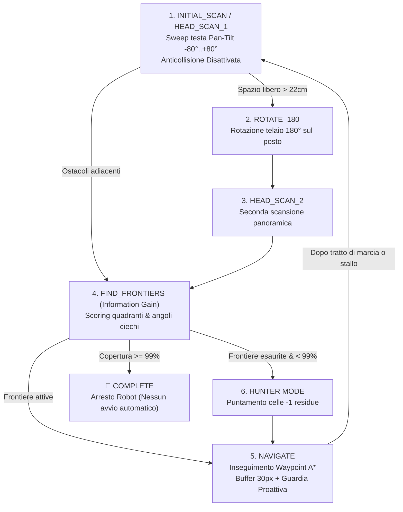

# Guida all'Esplorazione Autonoma, Mappatura SLAM e Visione VLM

Questa guida documenta l'architettura avanzata di **Esplorazione Autonoma dell'Ambiente e Mappatura Spaziale (SLAM)** implementata in parallelo nel motore JavaScript del simulatore e nel server Python del robot (`robot_server`), con supporto alla visione semantica locale Open-Vocabulary tramite **VLM (Vision-Language Model con Ollama / Moondream2)**, simulazione con **Texture Fotografiche Reali dei Mobili** e generazione della **Tavola Architettonica CAD del Geometra & Blueprint HD**.

---

## 🧭 1. Architettura a Due Fasi Distinte

Per garantire la massima efficienza e rispondere alle esigenze professionali (geometri, periti, architetti), il sistema separa nettamente le due fasi operative:

### Fase 1: Esplorazione Metrica e Mappatura SLAM (FSM Autonoma)
L'algoritmo di esplorazione adotta una **Finite State Machine (FSM)** potenziata con scansione panoramica iniziale, navigazione fluida $A^*$ con buffer di sicurezza $30\text{ px}$, e target al **99% di copertura** con **Hunter Mode**:



> [!IMPORTANT]
> **Arresto al termine della Fase 1**: Raggiunto il 99% di copertura, il robot arresta i motori e presenta la planimetria CAD quotata. **La Fase 2 non si avvia automaticamente**: spetta all'utente decidere se avviare il tour di ispezione semantica.

### Fase 2: Tour di Ispezione VLM su Richiesta Utente (`inspection_tour.js`)
Avviabile manualmente premendo **"Avvia Tour Ispezione VLM"**:
1. **Pianificazione Sequenziale dei Cluster**: Il robot calcola i punti di osservazione ottimali antistanti ciascun mobile o elettrodomestico scoperto nella Fase 1.
2. **Navigazione & Allineamento Continuo (Zero Teletrasporto)**: Il robot raggiunge il punto con frenata progressiva DWA ed esegue un **pivot turn continuo sul posto** ($\omega \le 2.2\text{ rad/s}$) per puntare frontalmente l'arredo prima dello scatto FPV.
3. **Scatto FPV & Interrogazione VLM**: L'immagine viene inviata ad **Ollama Moondream2** per ottenere la classificazione semantica pura (senza assunzioni rigide sulle dimensioni fisiche).

---

## 📐 2. Architettura Modulare (`simulazione/web_simulator/js/slam/`)

1. **`slam_grid.js`**: Matrice 2D `OccupancyGrid` isometrica ($70 \times 52$, celle $30 \times 30\text{ px} = 18.75 \times 18.75\text{ cm}$) a **0.0% di distorsione**.
2. **`slam_planner.js`**: Calcola la dilatazione morfologica a 3 celle ($30\text{ px}$), gestisce le frontiere e l'Hunter Mode per il $99\%$.
3. **`slam_navigator.js`**: Insegue i waypoint $A^*$ con controllo di velocità e disimpegno rapido in caso di stallo.
4. **`slam_clusters.js`**: Estrazione dei cluster d'arredo con supporto per ostacoli addossati a muro (`wallSides`, `minDist`) e fusione prossimale.
5. **`cad_renderer.js`**: Renderizza la **Tavola Architettonica CAD & Blueprint HD** con campitura muraria a 45°, quote metriche, simboli standard e cartiglio automatico.
6. **`inspection_tour.js`**: Macchina a stati per il tour d'ispezione con cinematica fisica continua.

---

## 🍽️ 3. Simulazione Fotorealistica & Pipeline VLM (Ollama Moondream2)

- **Asset Fotografici in Alta Risoluzione**: Arredi renderizzati con fotografie reali in prospettiva (`assets/furniture/`).
- **Classificazione Visiva Pura Open-Vocabulary**: Nessun bias di dimensione geometrica; riconoscimento affidato al modello locale Moondream2 (1.6B parametri, <1.5s di latenza).
- **Cartiglio Ufficiale CAD**: Riassume la destinazione d'uso (`Cucina Abitabile`), superficie calcolata e lista arredi catalogati.

---

## 🧪 4. Test e Validazione

* **Test Python (Backend Server & Logica)**:
  ```bash
  PYTHONPATH=mock_hardware:robot_server venv/bin/python simulazione/test_exploration.py
  ```

* **Test Unitari JavaScript (Simulatore, SLAM & Cinematica)**:
  ```bash
  node simulazione/test_slam_clusters.js
  node simulazione/test_wall_attached_object.js
  node simulazione/test_continuous_alignment.js
  node simulazione/test_overlay_mapping.js
  ```

