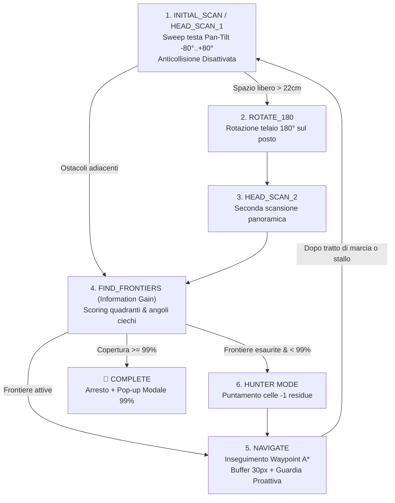

# Guida all'Esplorazione Autonoma, Mappatura SLAM e Visione VLM

Questa guida documenta la logica avanzata di **Esplorazione Autonoma dell'Ambiente e Mappatura Spaziale (SLAM)** implementata in parallelo nel motore JavaScript del simulatore e nel server Python del robot (`robot_server`), con supporto alla visione semantica locale tramite **VLM (Vision-Language Model con Ollama)** e generazione della **Tavola Architettonica CAD del Geometra (Campitura 45°, Riconoscimento Tramezzi e Quote CAD)**.

---

## 🧭 1. Architettura della Macchina a Stati (FSM)

L'algoritmo di esplorazione autonoma adotta una **Finite State Machine (FSM)** potenziata con scansione panoramica a 360° iniziale in due fasi, navigazione fluida $A^*$ con buffer 30px, e target al **99% di copertura** con **Hunter Mode**:



### Stati Operativi & Architettura Modulare (`simulazione/web_simulator/js/slam/`):
1. **`slam_grid.js`**: Inizializza la matrice 2D `OccupancyGrid` ($70 \times 52$) al **100% come inesplorata (`-1`)**, senza muri o dimensioni perimetrali preimpostate.
2. **`slam_planner.js`**: Calcola la dilatazione morfologica di sicurezza a **$3$ celle ($30\text{ px}$)**, gestisce le frontiere e l'Hunter Mode per il $99\%$.
3. **`slam_navigator.js`**: Insegue i waypoint $A^*$ con controllo proattivo di velocità e disimpegno rapido in caso di stallo ($> 45$ frame).
4. **`cad_dimensions.js`**: Analizza la topologia della mappa scoprendo **muri interni, tramezzi e speroni che partono dal perimetro**, calcolandone le misure reali ($L \times H$).
5. **`cad_renderer.js`**: Motore grafico per la resa della **Tavola Tecnica CAD da Geometra** (campitura a 45° sui muri sezionati, squadratura foglio, catene di quota e cartiglio catastale).

---

## 📐 2. Tavola Architettonica CAD & Misurazione Tramezzi

- **Campitura Muraria a 45°**: Tratteggio diagonale di sezione (`//////`) all'interno di tutti i muri scoperti, come nei veri progetti AutoCAD e catastali.
- **Riconoscimento Muri Sporgenti dal Perimetro**: Individuazione ed etichettatura metrica automatica per:
  - **Tramezzi e Speroni Murari** (pareti divisorie collegate alle pareti perimetrali, quotate con `Tramezzo Lm × Hm`).
  - **Muri Interni Indipendenti** (`Muro Lm × Hm`).
- **Squadratura Tavola e Cartiglio Professionale**:
  - Doppia linea perimetrale di squadratura tecnica.
  - Cartiglio tabellare con *Oggetto*, *Numero Muri e Tramezzi*, *Ingombro Rilevato*, *Superficie Utile Calpestabile in $\text{m}^2$*, *Scala 1:50* e *Stato Rilievo*.
- **Scala Metrica Grafica & Bussola Nord**.

---

## 🧪 3. Test e Validazione

Test automatici per griglia, dilatazione a 3 celle, $A^*$, angoli ciechi, Hunter Mode (99%) e VLM:
```bash
PYTHONPATH=mock_hardware:robot_server venv/bin/python simulazione/test_exploration.py
```
