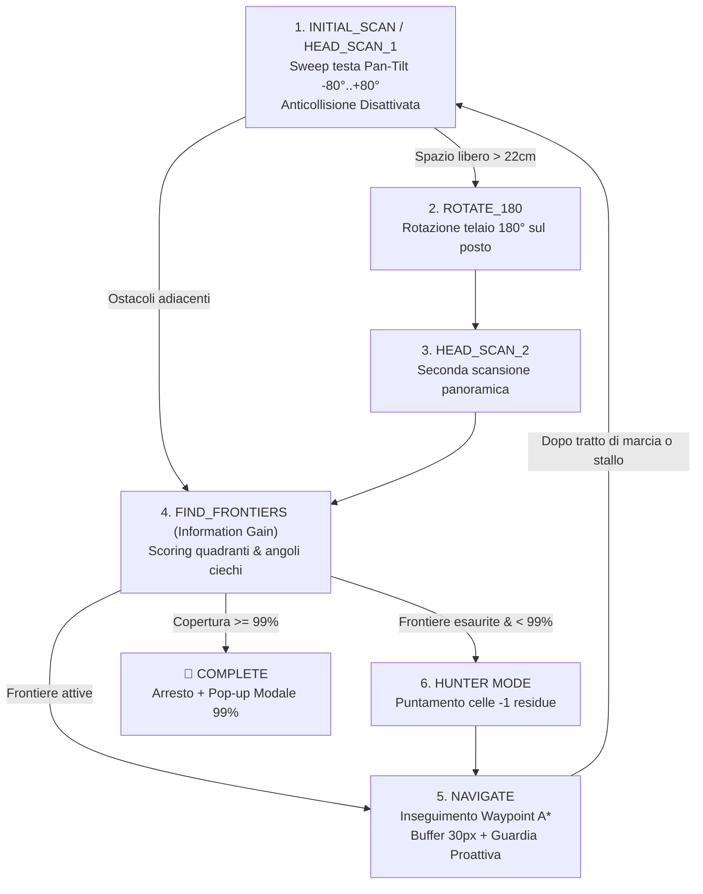

# Guida all'Esplorazione Autonoma, Mappatura SLAM e Visione VLM

Questa guida documenta la logica avanzata di **Esplorazione Autonoma dell'Ambiente e Mappatura Spaziale (SLAM)** implementata in parallelo nel motore JavaScript del simulatore e nel server Python del robot (`robot_server`), con supporto alla visione semantica locale tramite **VLM (Vision-Language Model con Ollama / LLaVA)**, simulazione con **Texture Fotografiche Reali dei Mobili** e generazione della **Tavola Architettonica CAD del Geometra**.

---

## 🧭 1. Architettura della Macchina a Stati (FSM)

L'algoritmo di esplorazione autonoma adotta una **Finite State Machine (FSM)** potenziata con scansione panoramica a 360° iniziale in due fasi, navigazione fluida $A^*$ con buffer 30px, e target al **99% di copertura** con **Hunter Mode**:



### Stati Operativi & Architettura Modulare (`simulazione/web_simulator/js/slam/`):
1. **`slam_grid.js`**: Inizializza la matrice 2D `OccupancyGrid` ($70 \times 52$) al **100% come inesplorata (`-1`)**, senza muri o dimensioni perimetrali preimpostate.
2. **`slam_planner.js`**: Calcola la dilatazione morfologica di sicurezza a **$3$ celle ($30\text{ px}$)**, gestisce le frontiere e l'Hunter Mode per il $99\%$.
3. **`slam_navigator.js`**: Insegue i waypoint $A^*$ con controllo proattivo di velocità e disimpegno rapido in caso di stallo ($> 45$ frame).
4. **`cad_dimensions.js`**: Analizza la topologia della stanza e correla i cluster geometrici con gli arredi identificati da VLM.
5. **`cad_renderer.js`**: Renderizza la **Tavola Architettonica CAD** con campitura a 45°, simboli d'arredo, etichette VLM e cartiglio (*Cucina Abitabile*).
6. **`render_fpv.js`**: Telecamera FPV con **texture fotografiche reali** in prospettiva (frigo inox, piano cottura, tavolo legno, bancone, credenza) e Bounding Box AI VLM.

---

## 🍽️ 2. Simulazione Fotorealistica & Pipeline VLM (Ollama / LLaVA)

Per garantire un'accuratezza visiva reale senza scorciatoie:
- **Asset Fotografici in Alta Risoluzione**: I mobili sono renderizzati nella telecamera FPV con vere fotografie di prodotto (`assets/furniture/`).
- **Inquadratura & Bounding Box**: Quando la telecamera FPV inquadra l'arredo, l'overlay disegna il **Bounding Box AI** con l'etichetta semantica.
- **Tavola CAD del Geometra**: I mobili scoperti vengono annotati con i loro simboli di arredo e quotati con precisione millimetrica.
- **Cartiglio Ufficiale**: Mostra `DESTINAZIONE: CUCINA ABITABILE (VLM LLaVA)` e riassume il conteggio degli arredi scoperti.

---

## 🧪 3. Test e Validazione

Test automatici per griglia, dilatazione a 3 celle, $A^*$, angoli ciechi, Hunter Mode (99%) e catalogo VLM:
```bash
PYTHONPATH=mock_hardware:robot_server venv/bin/python simulazione/test_exploration.py
```
