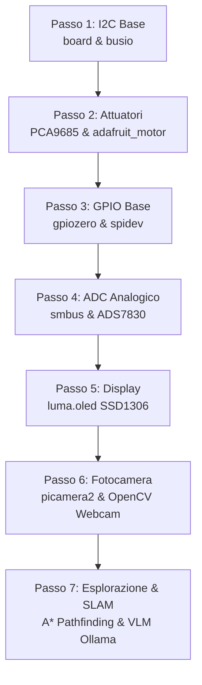

# Piano Didattico: Emulazione Hardware e Simulazione del Robot

Questo file serve a tracciare i progressi nello sviluppo e nella comprensione dei singoli moduli mock per far funzionare il server del robot Adeept 4WD sul tuo computer.

Spunta le caselle (`[x]`) man mano che completiamo e verifichiamo ciascun passo.

---

## 🗺️ Mappa del Percorso

---

## 📋 Lista delle Tappe

### [x] Passo 1: Le basi della comunicazione I2C (`board.py` e `busio.py`)
* **Obiettivo**: Comprendere il protocollo seriale I2C e simulare il bus dati.
* **Componenti**:
  * [x] Comprendere SDA, SCL e indirizzamento I2C.
  * [x] Creare `mock_hardware/board.py` con costanti di pin fittizie.
  * [x] Creare `mock_hardware/busio.py` con la classe di bus `I2C`.
  * [x] Scrivere e avviare lo script di test locale `simulazione/test_passo_1.py`.

### [x] Passo 2: Controllo dei servomotori e motori DC (`adafruit_pca9685` e `adafruit_motor`)
* **Obiettivo**: Comprendere i segnali PWM (modulazione di larghezza di impulso) per muovere attuatori.
* **Componenti**:
  * [x] Comprendere il funzionamento del driver I2C a 16 canali PCA9685.
  * [x] Creare `mock_hardware/adafruit_pca9685.py` (simulazione canali PWM).
  * [x] Creare la cartella `mock_hardware/adafruit_motor/` con `__init__.py`.
  * [x] Creare `mock_hardware/adafruit_motor/servo.py` (simulazione angoli).
  * [x] Creare `mock_hardware/adafruit_motor/motor.py` (simulazione throttle).
  * [x] Scrivere e avviare lo script di test locale `simulazione/test_passo_2.py`.

### [x] Passo 3: Input e Output Digitali (`gpiozero.py` e `spidev.py`)
* **Obiettivo**: Leggere stati logici alti/bassi e inviare impulsi di trigger.
* **Componenti**:
  * [x] Comprendere il funzionamento dei GPIO digitali (infrarossi line tracking, buzzer, ultrasuoni).
  * [x] Creare `mock_hardware/gpiozero.py` con classi per `LED`, `TonalBuzzer`, `PWMOutputDevice`, `DistanceSensor` e `InputDevice`.
  * [x] Creare `mock_hardware/spidev.py` per simulare la comunicazione SPI (per i LED WS2812).
  * [x] Scrivere e avviare lo script di test locale `simulazione/test_passo_3.py`.

### [x] Passo 4: Sensori analogici e convertitore ADC (`smbus.py`)
* **Obiettivo**: Convertire correnti/tensioni continue in valori digitali utilizzabili (0-255).
* **Componenti**:
  * [x] Comprendere il chip ADC ADS7830 (partitore di tensione batteria e fotoresistenze).
  * [x] Creare `mock_hardware/smbus.py` simulando le chiamate I2C per i canali dell'ADC.
  * [x] Scrivere e avviare lo script di test locale `simulazione/test_passo_4.py`.

### [x] Passo 5: Scrittura sul display OLED (`luma/`)
* **Obiettivo**: Visualizzare dati utili su uno schermo OLED grafico SSD1306.
* **Componenti**:
  * [x] Comprendere la libreria `luma.core` e il rendering raster.
  * [x] Creare i pacchetti mock per `luma.core` e `luma.oled`.
  * [x] Scrivere e avviare lo script di test locale `simulazione/test_passo_5.py`.

### [x] Passo 6: Flusso Video e Visione Artificiale (`picamera2.py` e `libcamera.py`)
* **Obiettivo**: Catturare le immagini della telecamera e integrarle con OpenCV.
* **Componenti**:
  * [x] Creare i mock per `libcamera.py` e `picamera2.py`.
  * [x] Configurare l'acquisizione video fittizia devitalizzando l'errore o deviandola sulla webcam di sistema.
  * [x] Avviare per la prima volta `WebServer.py` su Mac, collegarsi con la WebUI o la GUI desktop.
  * [x] Convalidare la ricezione dei comandi.

### [x] Passo 7: Esplorazione Autonoma, Mappatura SLAM & VLM (`core/` e `vision/`)
* **Obiettivo**: Mappare l'ambiente 2D sconosciuto, navigare verso le frontiere e identificare landmark visivi.
* **Componenti**:
  * [x] Griglia di occupazione 2D e raycasting Bresenham (`robot_server/core/occupancy_grid.py`).
  * [x] Rilevamento frontiere (BFS) e pianificatore traiettorie A* (`robot_server/core/frontier_planner.py`).
  * [x] Macchina a stati di esplorazione continua (`robot_server/behaviors/room_explorer.py` e `exploration.js`).
  * [x] Integrazione semantica Vision-Language Model con Ollama (`robot_server/vision/vlm_inspector.py`).
  * [x] Visualizzatore FPV 3D WebGL Three.js (`three_scene.js`) e renderer mappa (`render_map.js`).
  * [x] Test unitari convalidati in `simulazione/test_exploration.py`.
